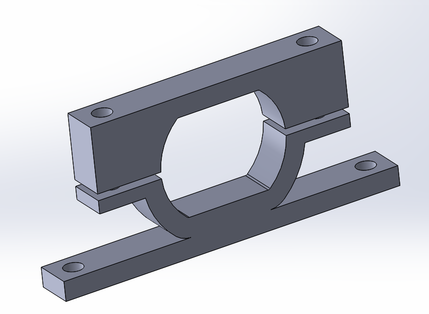
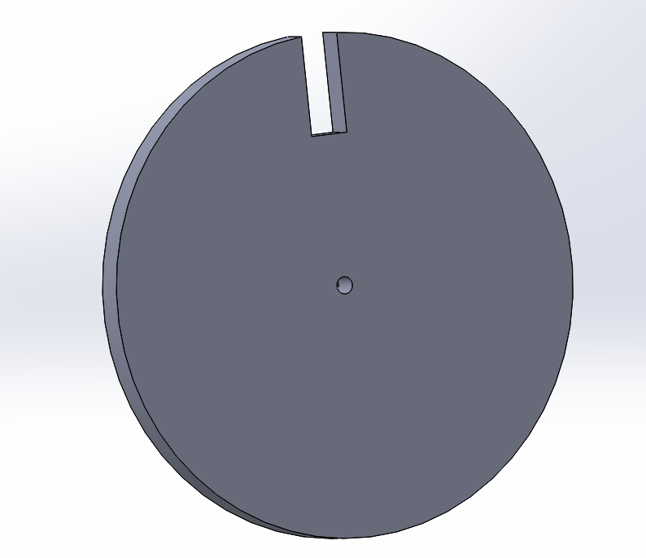
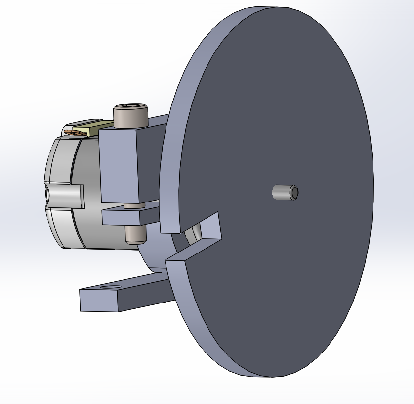
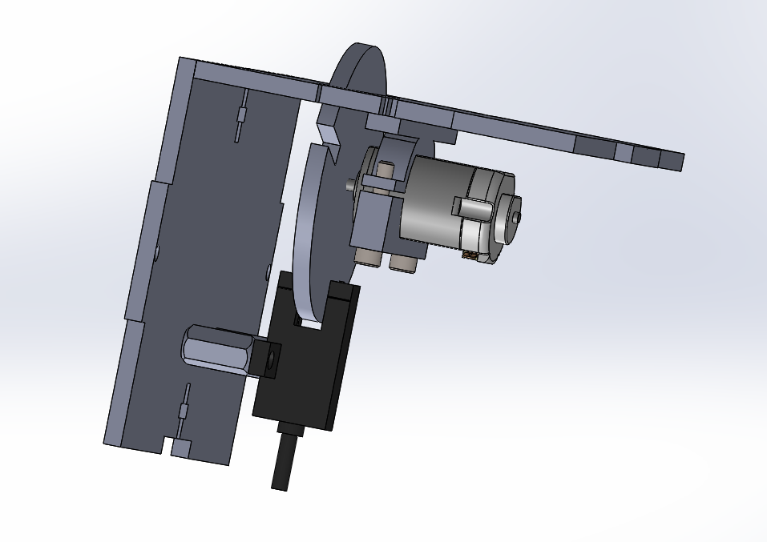
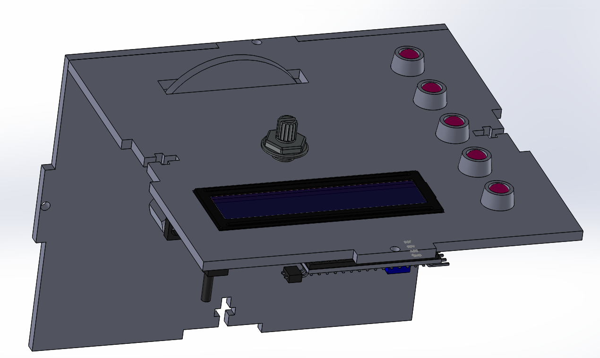

# PID-Box
## PID-Box Project <!--Temporary Title-->
The goal of the PID box project is to control the speed of a motor using a photinterrupter and PID.
## Project Timeline

|Week|Date| Planned Milestones|Actual Progress|
|----| -- | ----------------- |--------|
|1|10/28/19|Design mount for the motor, and the wheel|Designed mount for the motor, the wheel, and a simple t-slot wall|
|2|11/6/19|Design one wall assembly of motor, wheel, and  photointerrupter|Made assembly with the motor, photointerrupter, LCD, some indicator LEDs, and the potentiometer|
|3|11/11/19|Finish designing the box, add in LCD, LED indicators,  switches, battery pack, and potentiometer|Added switches, battery pack, and arduino; 3d printed motor mount|
|4|11/18/19|Add arduino, start assembling box|Started assembling, made fritzing diagram|
|5|12/2/19|Wire everything and get test code working|Mounted all but motor, due to its tendancy to attach crooked, started wiring|
|6||RPM code||
|7||PID code||
|8||Non-PID code||
|9||Wrap up loose ends||
|10||Delay compensation||
|11||Delay compensation||
|12||Delay compensation||

## Weekly Progress

<b>Week 1</b>

  
* Designed mount for motor
* Designed wheel 
 
 
 
On schedule

  

<b>Week 2</b>

  
* Made sub-assembly of the motor, wheel, and photointerrupter

 

* Added a row of LEDs that will show the speed

  On schedule

  

<b>Week 3</b>

  
* Added in the rest of the components
* 3d printed the motor mount
* Made drawing of all PID box walls

  On schedule

  

<b>Week 4</b>

  
* Laser cut all walls
* Drilled to fix some holes that were the wrong size
* Recut a wall to have labels
* Started making fritzing diagram
On Schedule

  

<b>Week 5</b>

  
* Got potentiometer and motor control working with test code
* Broke the wheel trying to put it on
* Made the hole in the wheel slightly wider and recut
* Having trouble attaching the motor and wheel straight
 Behind due to delays in mounting motor 

  

<b>Week 6</b>

<b>Week 7</b>

<b>Week 8</b>

<b>Week 9</b>

